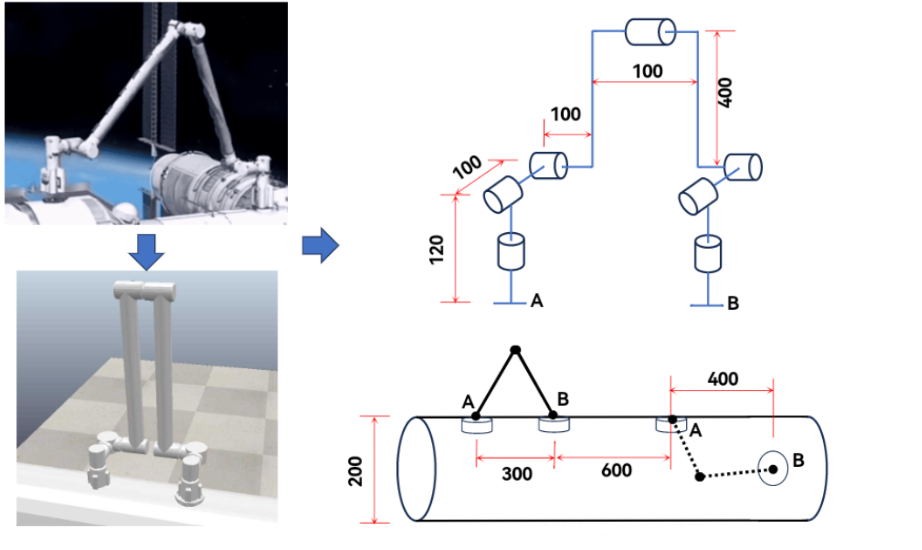
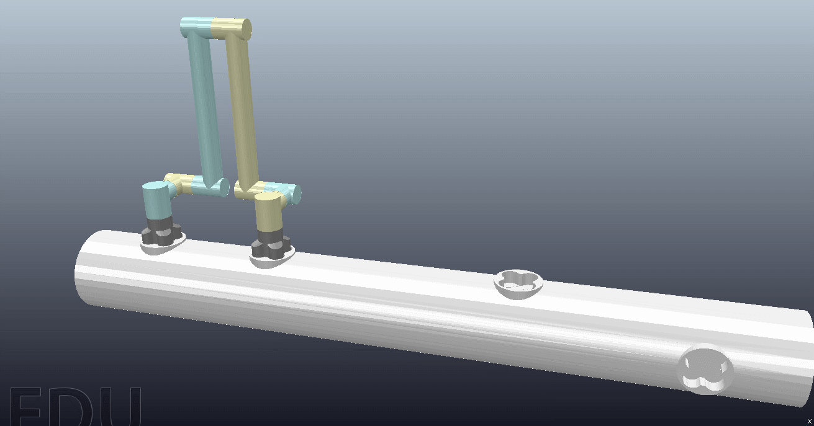

# space_robot

**Read this in other languages: [English](README.md), [中文](README_zh.md).**

Course project: simulation of a space station robotic arm

## Introduction

The arm features symmetry, both sides can be used as ends and bases, and can walk on the space capsule.

## Usage

After opening the ttt file with Coppeliasim, just run 'space_robot.py'. And there seems to be a bug after the side change, and you will know that there are strange places in my code.

## Others

I also uploaded the code 'calculate_matrix.nb' that uses mathematica to calculate the forward and inverse kinematics (the solution of inverse kinematics must be solved by myself in the end, and the software is only used to simplify), as well as the derivation process.
