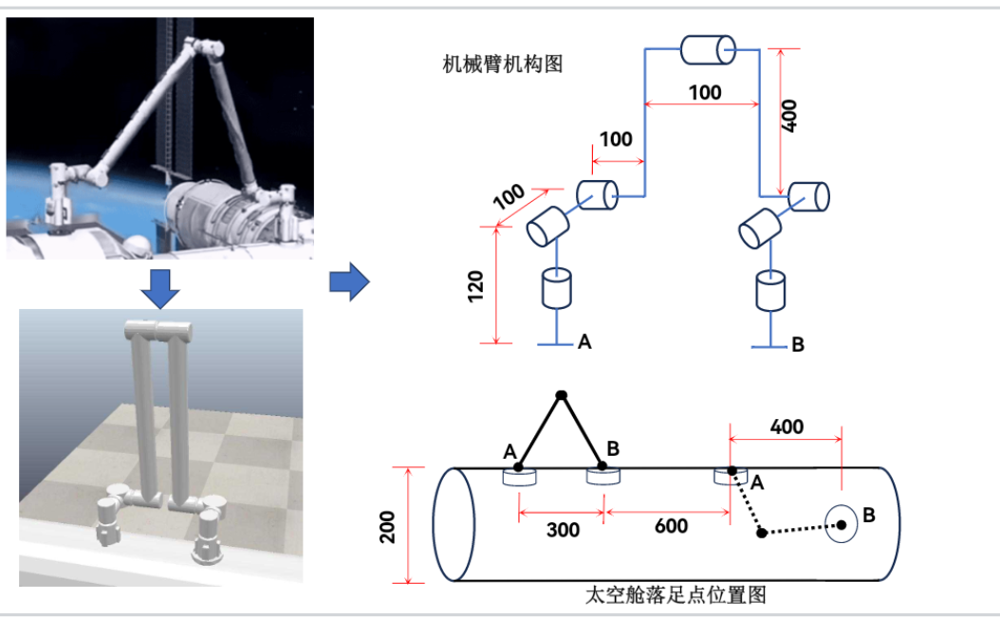
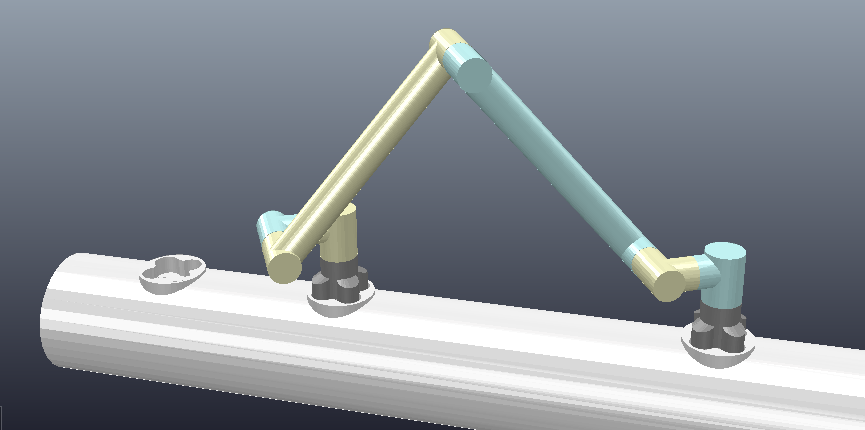

# space_robot

浙江大学 2023年短学期《机器人与智能系统综合实践》 
实验一 中国空间站机械臂运动仿真

## 介绍

该机械臂的特色为对称，两端均可作为末端和底座，可以在太空舱上行走。

## 使用方法

用Coppeliasim打开ttt文件后，运行`space_robot.py`即可，写得很仓促，中期检查的时候完成了所有的要求，后面也没改了。而且好像换脚之后有bug，看了我的代码就知道有奇怪的改动。

## 其他

还上传了使用mathematica运算正逆运动学的代码`calculate_matrix.nb`（逆运动学的求解最后还是要自己求解，软件只是用来化简），以及推导的过程，过程仓促，仅供思路的参考

